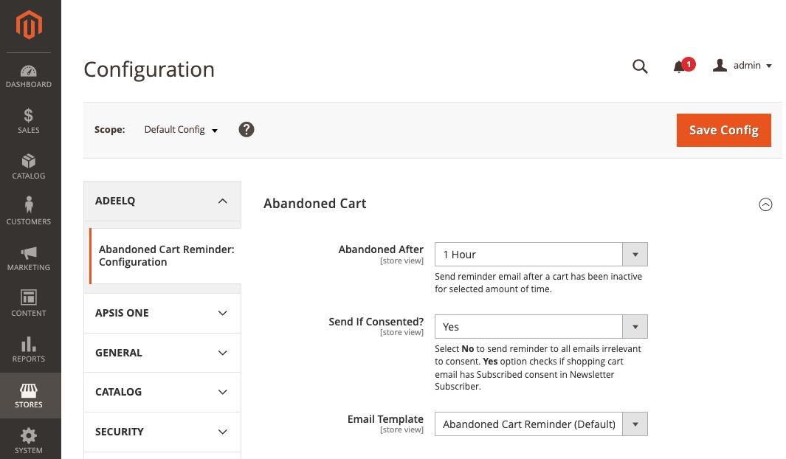
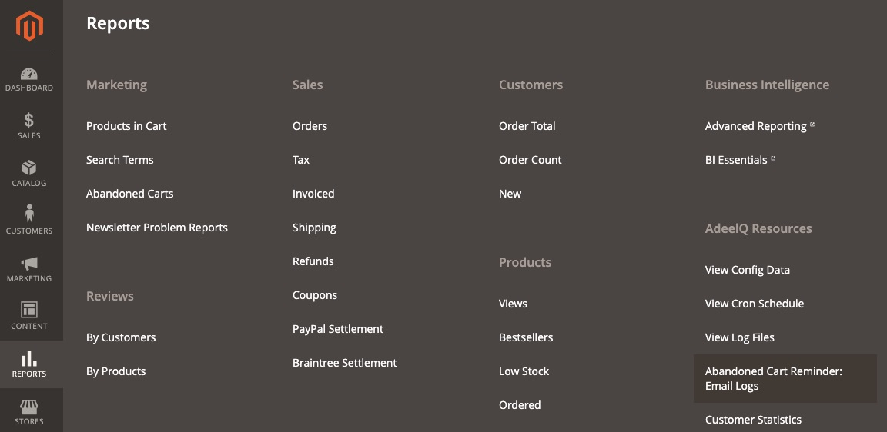
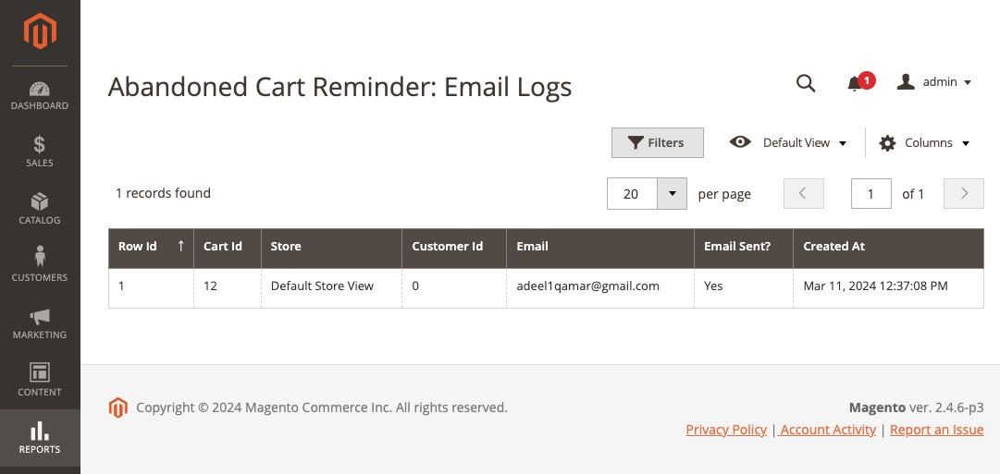
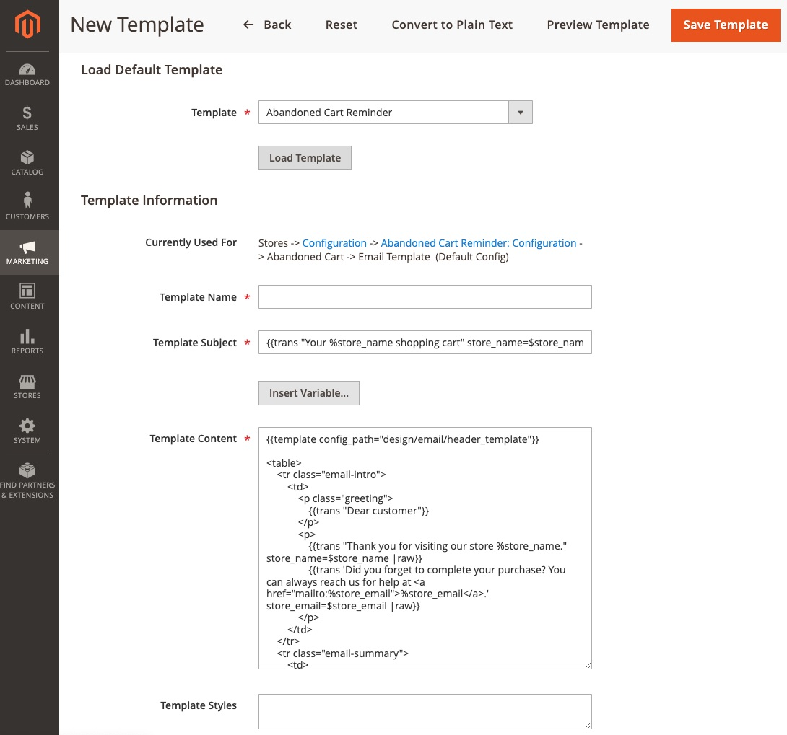
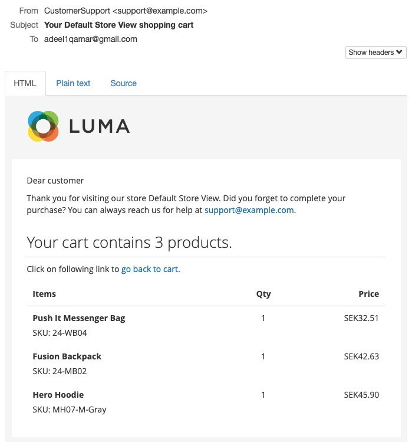

Magento 2 - Abandoned Cart Reminder
 ======
 
[](LICENSE)

A module which sends reminder email to customer upon cart abandonment after certain time has passed. User can configure cart abandonment duration in the module configuration as well as view the logs for reminder emails sent in the provided grid in REPORTS menu.

By default, module only sends reminder email to those emails that has given opt-in consent in newsletter entity. This option is configurable in the module configuration, to bypass consented option and send email to all emails irrelevant to consent.

Email template is editable, it can be edited in admin backOffice menu item MARKETING -> Email Templates -> Add New Template -> Load Default Template -> 'AQ Abandoned Carts: Reminder Email'. Newly created template can be used for sending Abandoned Cart reminders by mapping it in module's configuration.

## Requirements

- Magento 2.3+
- Magento module(s) dependency
    - Sales
    - Config
    - Quote
    - Catalog
    - Store
- Adeelq core module

## Installation

It is recommended to use [composer](https://getcomposer.org) to install the module.

```bash
composer require adeelq/magento2-abandoned-cart-reminder
```
If you do not use composer, ensure that you also load any dependencies that this module has.

## Screenshots
### Configuration page


### Menu


### Grid page


### Edit email template


### Sample abandoned cart reminder email


## Documents

Download [user guide](guide.pdf) for offline viewing.
